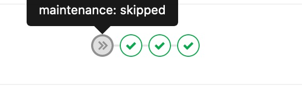
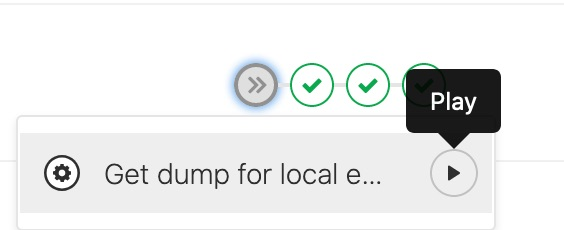
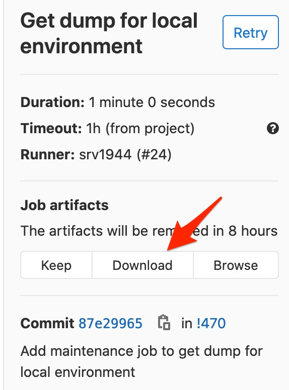

.. include:: ../../../Includes.txt
.. highlight:: shell

=====================================
Setup ddev environment (docker based)
=====================================

.. contents:: On this page:
   :backlinks: top
   :class: compactlist
   :local:

Local installation of one of the typo3.org sites
================================================

Requirements
------------

All you need is ddev and Docker installed.

Installation
------------

Preparation
~~~~~~~~~~~

.. rst-class:: bignums

#. Install Docker - `find it here <https://www.docker.com/community-edition#/download>`_

#. Install ddev - `find it here <https://ddev.readthedocs.io/en/latest/#installation>`_

Clone and prepare files
-----------------------

.. rst-class:: bignums

#. Clone your website repository (in case for typo3.org -
   `find it here <https://gitlab.typo3.org/t3o/typo3.org>`_)

#. Copy the ./auth.json.example to ./auth.json

#. Edit the ./auth.json file and add your gitlab (gitlab.typo3.org) account

#. `ddev start`

#. Download and extract the ZIP file the DB dump, see `Download assets`_

#. Use `ddev import-db` and follow the wizard to import the SQL file into the database

#. Browse to `the frontend <https://typo3.org.ddev.site/>`_ or `the backend <https://typo3.org.ddev.site/typo3/>`_

Download assets
---------------

To download the database dump, you need to visit the CI/CD area. For e.g. the typo3.org project,
it's `here <https://gitlab.typo3.org/t3o/typo3.org/pipelines>`_.

Check for an existing maintenance stage in one of the pipelines:

Then open the stage and click on the play button to create a dump for local environment:

Wait for the build to end and click on the result page.
There you can see the `Download` link in the right column:

Work on CSS and JS
------------------

The CSS and JS are built on every start of ddev. If you need to update them, just run `ddev start`.
If you work on CSS and JS, you are able to use the built-in `npm` in the docker container by

.. rst-class:: bignums

#. Run `ddev ssh`

#. Run `npm watch --prefix=private/typo3conf/ext/t3olayout/Build`

#. Change CSS and JS, the changes are generated live

Get TYPO3 up and running
------------------------

As there are no backend users in the dump, you need to setup a local admin account.

.. rst-class:: bignums

#. `ddev ssh`

#. `../bin/typo3cms database:updateschema` to update the database because the dump included in the assets you downloaded is missing some tables like sys_domain or caching related ones.

#. `../bin/typo3cms backend:createadmin` and set your username and password in the prompt. (You may need to call one of the scripts directly in the given directory, f.e. `php typo3-console.php backend:createadmin

Use built-in Solr server
------------------------

If you want to use the Solr server (important for TER) you need to use the built-in Solr docker container.
You can access the Solr admin panel: `<typo3.org.ddev.local:8983>`_

The Solr docker image is running by default and is usable without configuration.

Troubleshooting
---------------

The command `ddev start` fails due to npm processes. What can I do?
   You need to remove the folder `node_modules` located in `private/typo3conf/ext/t3olayout/Build/` and clear the npm caches on
   the machine with `ddev exec npm cache clear --force`. After that, `ddev start` should work again.

I can't login in the frontend with my LDAP user.
   Due to data protection issues, LDAP login isn't working for the local development. You need to setup an own frontend user.

